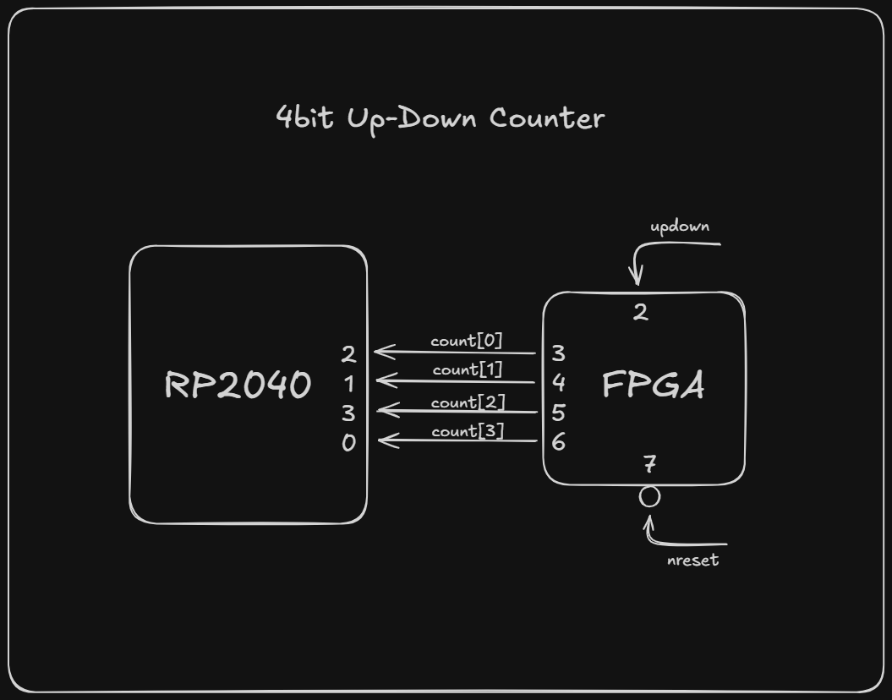
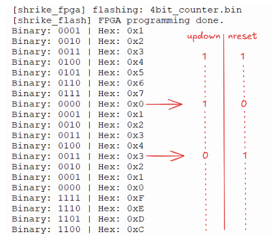

# 🧮 4-Bit Up/Down Counter on Vicharak Shrike-Lite  

## 1. Project Overview & Objective

This project implements a **4-bit up/down counter in Verilog** on the **Vicharak Shrike-Lite** FPGA dev board and demonstrates how the **RP2040 microcontroller reads FPGA-generated data in real time** using MicroPython.

The goal is to help the readers understand:

- Synchronous digital logic design in Verilog  
- FPGA pin-level signal exposure  
- Parallel data transfer from FPGA to MCU  
- Hardware–software co-design using MCU + FPGA boards  

This counter is intentionally simple so the **communication mechanism** is easy to observe and reason about.

---

## 2. System Description (FPGA ↔ RP2040)

### FPGA
- Implements a **4-bit synchronous counter**
- Supports **up and down counting**
- Uses a clock divider to slow the count rate (~1 Hz)
- Continuously drives the counter value on GPIO pins

### RP2040
- Programs the FPGA bitstream
- Samples FPGA GPIO outputs
- Reconstructs the counter value
- Displays output in **binary and hexadecimal**

---

## 3. FPGA Verilog Design (Go Configure Software Hub)

> The bitstream for the Renesas FPGA in Shrike-Lite can only be generated in the Go Configure Software hub for now. So once it is installed in your pc, Select the appropriate fpga part [`SLG47910V (Rev BB)`] and create new project. Once created, double click on the fpga core square to open ForgeFPGA Workshop window and paste the verilog code from `./ffpga/src/counter.v` into main.v and click on synthesize button.

### Top-Level Module

~~~verilog
(* top *) module counter(
    (* iopad_external_pin, clkbuf_inhibit *) input clk,
    (* iopad_external_pin *) input nreset,
    (* iopad_external_pin *) input up_down,
    (* iopad_external_pin *) output [3:0] out_oe,
    (* iopad_external_pin *) output osc_en,
    (* iopad_external_pin *) output [3:0] count
);
~~~

- `clk`    : Clock input to the FPGA  
- `nreset` : **Synchronous active-low reset**
- `up_down`: Controls counting direction  
- `count`  : 4-bit counter output  

Output control:

~~~verilog
assign out_oe = 4'b1111;        // to configure count signal pins as outputs
assign osc_en = 1'b1;           // to enable clock
assign count  = counter_reg;    // Counter Output
~~~

---

### Timing & Counter Logic

A **26-bit register (`time_steps`)** is used as a clock divider:

~~~verilog
if (time_steps >= 26'd49_999_999)
~~~

- Counter updates roughly **once per second**
- `up_down = 1` → increment
- `up_down = 0` → decrement
- 4-bit width naturally causes wrap-around

This demonstrates clean **synchronous sequential logic**.

---

## 4. Pin Connections

### Counter Data Lines (FPGA → RP2040)

| Signal     | FPGA Pin | RP2040 Pin |
|-----------|----------|------------|
| `count[0]` | GPIO3 | GPIO2 |
| `count[1]` | GPIO4 | GPIO1 |
| `count[2]` | GPIO5 | GPIO3 |
| `count[3]` | GPIO6 | GPIO0 |

These four lines form a **4-bit parallel data bus** from FPGA → RP2040.

### Control Signals

| Signal   | FPGA Pin | Description |
|--------|----------|-------------|
| `nreset` | GPIO2 | Synchronous active-low reset |
| `up_down` | GPIO7 | Controls up/down counting |

### I/O Planner (in Go Configure Software Hub)
>Tick the following check boxes in I/O Planner after synthesizing the verilog code.

- [x] CLK
- [x] GPIO
- [x] OSC_ctrl

>Then, configure the ports as shown below. Finally, save all files and click on Generate Bitstream.

| FUNCTION   | DIRECTION | PORT |
|--------|----------|-------------|
| `OSC_CLK` | Input | clk |
| `GPIO02_IN` | Input | updown |
| `GPIO03_OUT` | Output | count[0] |
| `GPIO03_OE` | Output | out_oe[0] |
| `GPIO04_OUT` | Output | count[1] |
| `GPIO04_OE` | Output | out_oe[1] |
| `GPIO05_OUT` | Output | count[2] |
| `GPIO05_OE` | Output | out_oe[2] |
| `GPIO06_OUT` | Output | count[3] |
| `GPIO06_OE` | Output | out_oe[4] |
| `GPIO07_IN` | Input | nreset |
| `OSC_EN` | Output | osc_en |

> The Bitstream file can be found in the project root folder as `.\ffpga\build\bitstream\FPGA_bitstream_MCU.bin`. You can rename it to any name but make sure to keep the `.bin` file extension. Don't forget to upload the bitstream file to shrike's rp2040 file system either by copy-pasting it through file explorer or by uploading using thonny directly. 

## 5. RP2040 MicroPython Implementation

### Flashing the FPGA

~~~python
import shrike
shrike.flash("4bit_counter.bin")
~~~

---

### Reading and Decoding Counter Value

~~~python
cntr_pins = [2, 1, 3, 0]
counter = [Pin(pin, Pin.IN) for pin in cntr_pins]
~~~

Each pin corresponds to one counter bit.  
The RP2040 reconstructs the value using bit shifts:

~~~python
value += (1 << i)
~~~

Formatted output:

~~~python
binary_str = "{:04b}".format(value)
hex_str = "{:X}".format(value)
print(f"Binary: {binary_str} | Hex: 0x{hex_str}")
~~~

>Connect the Shrike board and Open Thonny. Select MicroPython (RP2040) Interpreter along with correct COM Port at the bottom right corner of the Thonny window. Create a new file and paste the code from `.\firmware\micropython\counter_test.py` into it. Save it and click on run button in the top row to run the code on the Shrike board. Output is printed to the Shell.

---

## 6. Hardware Diagram & Significance

 
*Block-level view of the Up/Down Counter showing the FPGA-generated 4-bit counter, parallel data bus to RP2040, and control signals.*

### Result:

*Serial Output from RP2040 showing the up-counting, reset, and down-counting functionality of the counter.*

>Note: Noise and Interference on the GPIO input pins of the FPGA is also considered as a logic high (1). Thus, Physical connection of input pins to 3.3V to stay in up-counting mode or to stay out of reset is simply not required in this scenario.