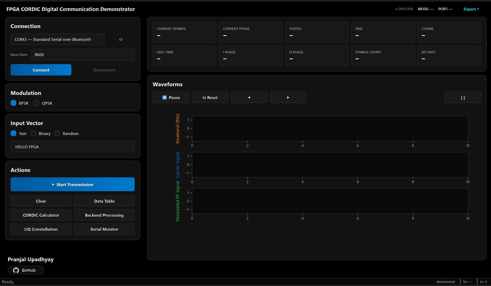
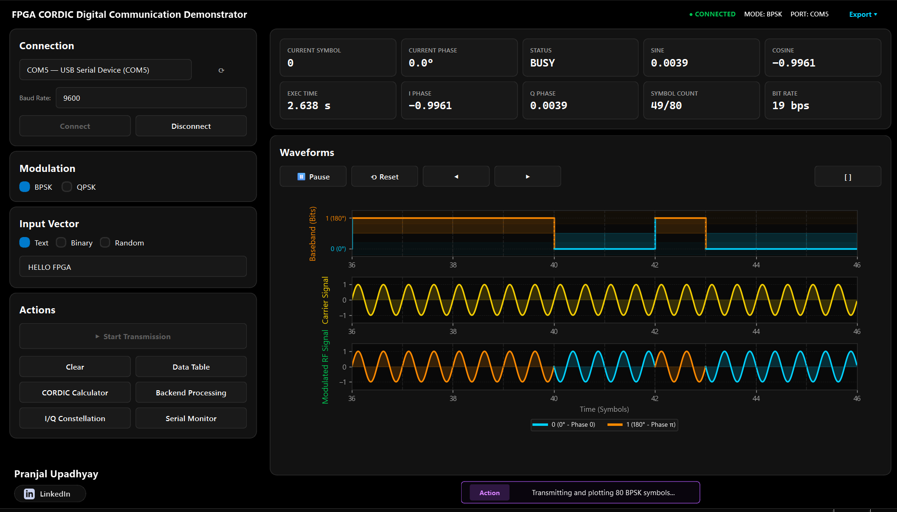
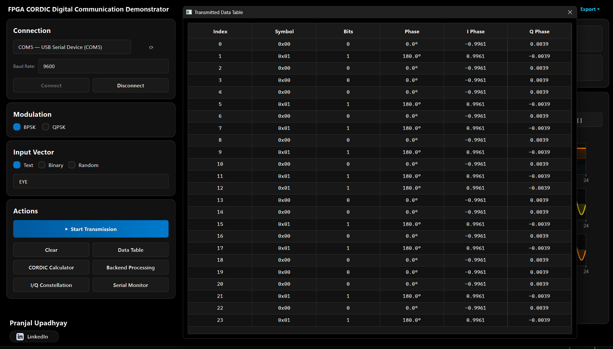
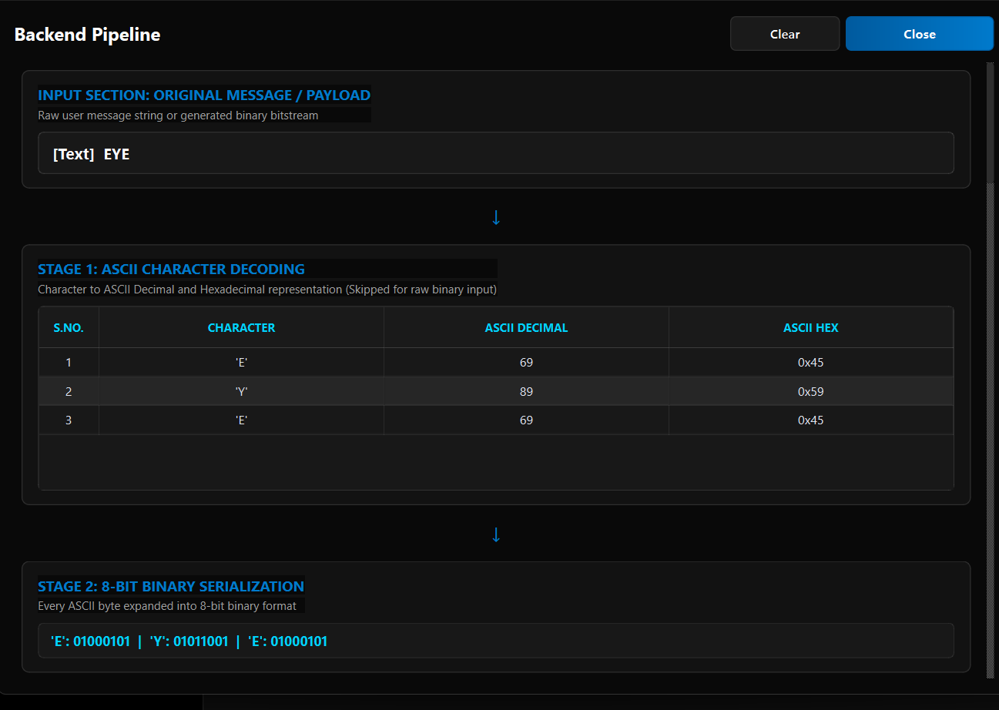
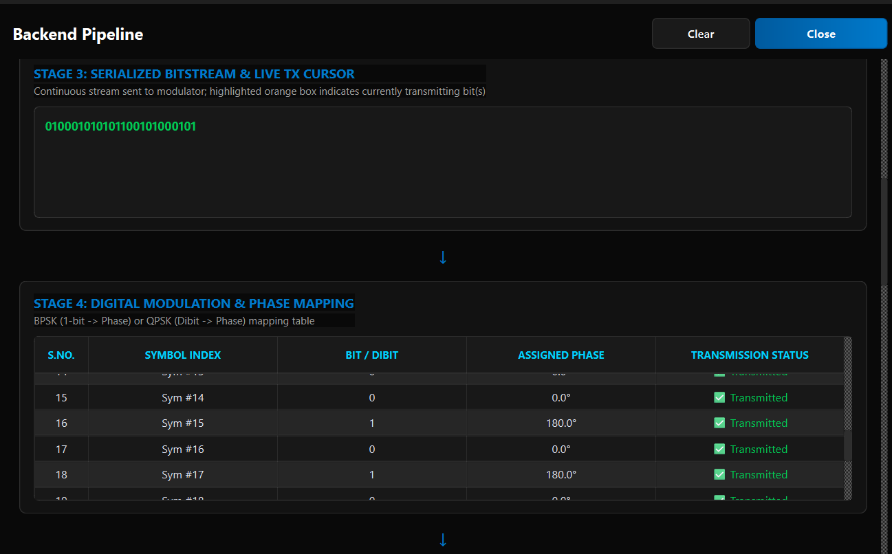
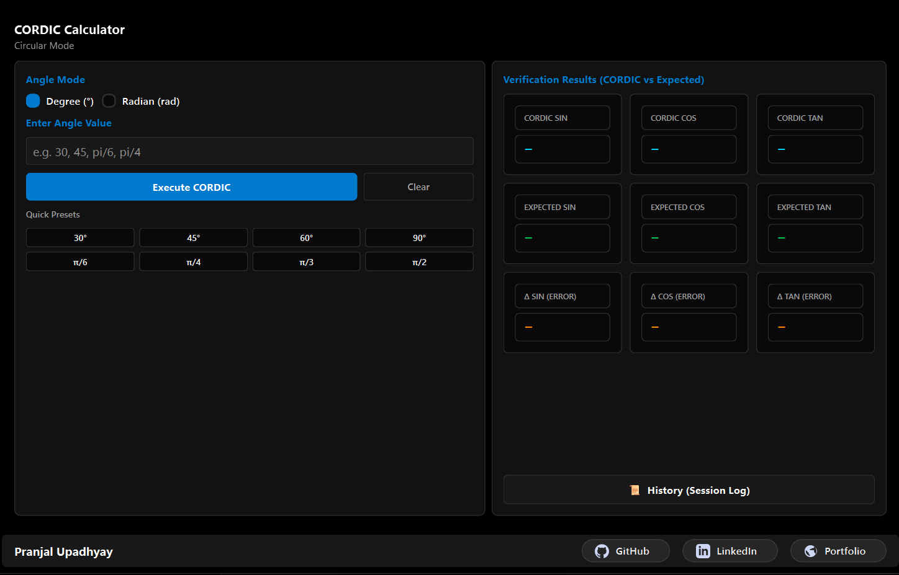

# Graphical User Interface (GUI) Guide

The Python Host GUI serves as the primary interface between the user and the FPGA-Based CORDIC Digital Communication Demonstrator.

It provides complete control over serial communication, digital modulation, waveform visualization, FPGA CORDIC verification, backend processing inspection, and transmission analysis in a single application.

---

# Main Dashboard

  

The main dashboard is divided into multiple functional sections that allow users to configure communication, transmit data, observe FPGA-generated signals, and inspect transmission statistics in real time.

---

## Connection Panel

Responsible for establishing communication with the RP2040 through USB Serial.

**Features include**

- Automatic serial port detection
- Baud rate selection
- Connect / Disconnect controls
- Connection status monitoring

Once connected, the GUI continuously exchanges packets with the RP2040, which forwards requests to the FPGA over SPI.

---

## Modulation Selection

Allows the user to select the modulation technique implemented in hardware.

**Supported modes**

- BPSK
- QPSK

The selected modulation determines how binary symbols are mapped into carrier phases inside the FPGA.

---

## Input Vector

Defines the data to be transmitted.

**Supported input modes**

- ASCII Text
- Binary Stream
- Random Bit Generation

The selected input is converted into a serial bitstream before transmission.

---

## Action Panel

Provides access to all major GUI utilities.

**Available functions include**

- Start Transmission
- Clear Session
- Transmitted Data Table
- Backend Processing Viewer
- CORDIC Calculator
- I/Q Constellation Viewer
- Serial Monitor

These tools provide both operational control and educational visualization of the communication pipeline.

---

## Real-Time Status Cards

The dashboard continuously displays the most recent information received from the FPGA.

The cards include

- Current Symbol
- Current Phase
- Current Status
- Current SIN
- Current COS
- Execution Time
- I Phase
- Q Phase
- Symbol Count
- Bit Rate

These values are updated live while transmission is in progress, allowing users to observe the latest FPGA-generated symbol and corresponding trigonometric outputs.

---

## Waveform Viewer

  

The waveform viewer visualizes the complete digital communication process in real time.

Displayed plots include

- Baseband Bit Stream
- Carrier Signal
- Modulated RF Signal

During transmission, the plots are updated continuously as symbols are received from the FPGA.

Additional controls allow users to

- Pause plotting
- Resume plotting
- Reset graphs
- Navigate through captured samples
- Export captured data

The visualization demonstrates how binary symbols are converted into phase-modulated carrier waveforms.

---

# Data Table

  

The Data Table displays every transmitted symbol together with the values generated by the FPGA.

Each row represents one transmitted symbol and includes

- Symbol Index
- Symbol Value
- Input Bit / Dibit
- Assigned Carrier Phase
- I Component
- Q Component

This table is useful for

- Verifying transmitted data
- Checking FPGA outputs
- Debugging communication
- Comparing hardware results across symbols

---

# Backend Processing Viewer

  

 

  

The Backend Processing Viewer provides a visual representation of the complete digital communication pipeline.

It illustrates how user input is converted into binary data, mapped into BPSK or QPSK symbols, processed by the FPGA CORDIC engine, and finally transformed into the corresponding modulation parameters used for transmission. The viewer presents each processing step in real time, making it easier to understand the complete data flow from the input message to the generated communication symbols.

---

# CORDIC Calculator

  

The CORDIC Calculator provides a convenient interface for validating the FPGA CORDIC engine independently of the communication demonstrator.

Users may compute

- Sine
- Cosine
- Tangent

using either

- Degree Mode
- Radian Mode

---

## Features

- Degree and Radian input selection
- Manual angle entry
- One-click FPGA execution
- Common angle quick presets
- Session history logging

---

## Verification Panel

For every requested angle, the calculator displays

- FPGA CORDIC SIN
- FPGA CORDIC COS
- FPGA CORDIC TAN

alongside

- Software reference SIN
- Software reference COS
- Software reference TAN

It also computes the absolute numerical error for each trigonometric function, enabling direct verification of FPGA accuracy against floating-point software calculations.

The calculator serves as both a hardware validation tool and an educational demonstration of the CORDIC algorithm implemented on the FPGA.