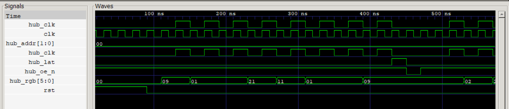
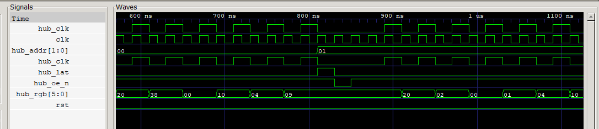
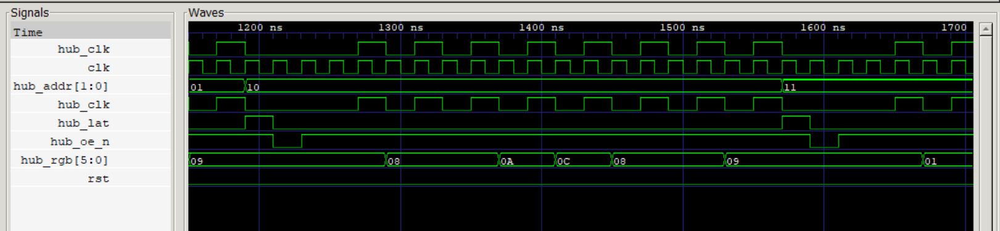
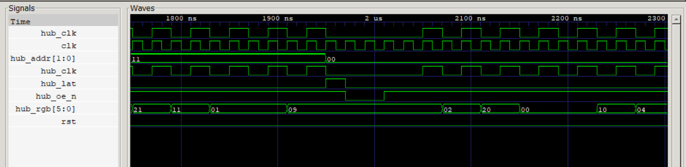
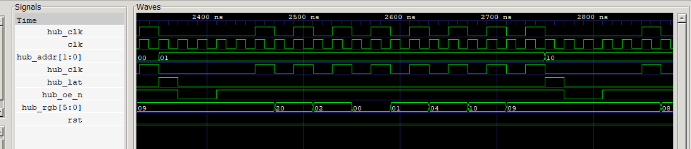
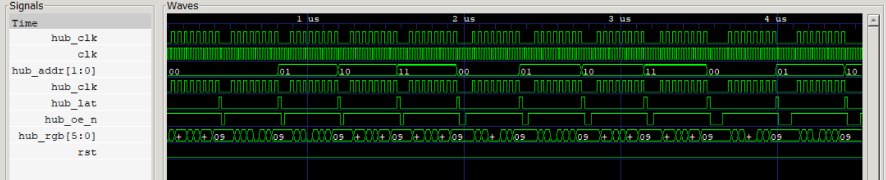

# HUB75 RGB LED Matrix Driver

**Difficulty:** Intermediate
**Uses MCU:** No (simulation only)
**External Hardware:** None (simulation only)

> ## ⚠️ Simulation-only example
>
> This example **designs and verifies a HUB75 driver entirely in simulation** —
> no board, no bitstream, no panel required. A self-checking testbench acts as a
> virtual HUB75 panel, watches the driver's output pins, rebuilds the displayed
> frame, and checks it against the source image.
>
> The RTL is written to be synthesisable for the ForgeFPGA and a pin-mapping
> guide is included ([`PINOUT.md`](PINOUT.md)), but it has **not** been built to
> a bitstream or tested on hardware — that is intentionally out of scope here.

## Overview

A parameterised HUB75 RGB-LED-matrix controller for the Shrike-fi (Renesas
SLG47910V ForgeFPGA). **One ForgeFPGA drives one panel.** It defaults to an
**8×8** panel and is parameterised for other sizes. Colour is produced by
**Binary-Code-Modulation (BCM)**, default **4 bits per channel (4096 colours)**.
You'll learn how a HUB75 panel is scanned (two halves, row-select, shift +
latch + blank) and how BCM turns on/off LEDs into brightness levels.

## Compatibility

| Board                 | FPGA design        | Status                          |
|-----------------------|--------------------|---------------------------------|
| Shrike-Lite (RP2040)  | `src/main.v`       | ⬜ Simulation only (not on HW)  |
| Shrike (RP2350)       | `src/main.v`       | ⬜ Simulation only (not on HW)  |
| Shrike-fi (ESP32-S3)  | `src/main.v`       | ⬜ Simulation only (not on HW)  |

> No pre-built bitstream or firmware is included — this example is verified in
> simulation, not on a physical board.

## Hardware Setup

No external hardware required. This example runs entirely in a Verilog
simulator.

## Run the simulation

Requires [Icarus Verilog](http://iverilog.icarus.com/) (`iverilog` + `vvp`);
optionally [GTKWave](https://gtkwave.sourceforge.net/) for waveforms.

```bash
cd sim
make                       # Linux/macOS/Git-Bash
# or on Windows PowerShell:
powershell -File run_sim.ps1
```

Expected output — the recovered picture matches the source image exactly:

```
--- ASCII (dominant colour, '.'=off) ---
  RRRRRRRR
  RG....BR
  R.GRRB.R
  R..GB..R
  R..BG..R
  R.BRGG.R
  RB....GR
  RRRRRRRR

RESULT: PASS  (all 64 pixels x 3 channels match)
```

Simulate other sizes by generating a matching image:

```bash
cd sim
python gen_image.py 16 16 4 image_16x16.hex
iverilog -g2012 -DP_COLS=16 -DP_ROWS=16 -DP_BPP=4 \
         -DHUB75_SIM_INIT -DHUB75_INIT_FILE='"image_16x16.hex"' \
         -o tb.vvp ../src/main.v tb_hub75.v && vvp tb.vvp
```

Verified passing: **8×8/BPP4**, **16×16/BPP4**, **32×16/BPP2**, **64×32/BPP4**,
**64×64/BPP2**, plus `BPP=1` and `BPP=8`.

## How It Works

A HUB75 panel has no memory of its own — the FPGA must continuously redraw it.
The design (`src/main.v`) is three small modules:

1. **`hub75_framebuffer`** — the picture memory. `ROWS×COLS` words of `3·BPP`
   bits (`{R,G,B}`), with two read ports so the driver fetches an upper-half and
   a lower-half pixel at once. In simulation it is preloaded from the hex image
   via `$readmemh`.
2. **`hub75_driver`** — a 3-state machine: **SHIFT** clocks all `COLS` pixels of
   one row into the panel on `hub_clk` (2 clocks/pixel, blanked); **LATCH**
   pulses `hub_lat` and drives the row address `hub_addr`; **DISPLAY** lights the
   row (`hub_oe_n` low) for `DISP_BASE·2^plane` clocks, then advances.
3. **`hub75_top`** — the pin wrapper. Satisfies the ForgeFPGA rules (`(* top *)`,
   `clkbuf_inhibit` on the clock, a `_oe` output-enable per pin tied high,
   `clk_en` high) and connects framebuffer → driver → pins.

**Colour via BCM:** an LED is only on or off, so a shade is made by *time*.
Bit-plane 0 is shown for 1 clock, plane 1 for 2, plane 2 for 4, plane 3 for 8.
Over one frame the on-time of a channel equals its 0–15 value.

**How the testbench verifies it (`sim/tb_hub75.v`):** it behaves like a real
panel — samples the colour bits on each `hub_clk` rising edge, measures how long
`hub_oe_n` stays low per line (that duration *is* the bit-plane weight), and
accumulates `bit × weight` per pixel over one frame. Dividing out the time unit
recovers the original values, which it compares to the source image — printing
**PASS** only if every pixel and channel matches.

### Parameters (set on `hub75_top`)

| Param       | Default | Meaning                                                   |
|-------------|---------|-----------------------------------------------------------|
| `COLS`      | 8       | panel width in pixels (≥ 2)                               |
| `ROWS`      | 8       | panel height in pixels (even, ≥ 4)                        |
| `BPP`       | 4       | colour bits per channel (1–8)                             |
| `DISP_BASE` | 1       | display clocks for the LSB bit-plane (brightness/refresh) |

## Expected Output

Waveforms captured in GTKWave from `sim/tb_hub75.vcd`:

**One row shifted out and latched** — 8 pixels clocked in, then a `hub_lat` pulse.


**Row advancing** — `hub_addr` updates at the latch and holds while the next row shifts.


**Row-address scan** — `hub_addr` sweeps `01 → 10 → 11` across the panel.


**Bit-plane wrap** — after the last row, `hub_addr` wraps and `hub_oe_n` lit-time starts growing.


**Plane-1 scan** — same row sweep with a wider `hub_oe_n` lit-time (weight 2).


**Full BCM staircase** — zoomed out: `hub_oe_n` lit-time doubles per bit-plane (1 → 2 → 4 → 8 clocks).


## Files

```
hub75/
├── README.md          this file
├── PINOUT.md          IO-planner pin mapping (hardware reference; not needed to simulate)
├── src/
│   ├── main.v         hub75_top + hub75_driver + hub75_framebuffer
│   └── spi_target.v   optional ESP32-S3 SPI write path (hardware reference)
├── sim/
│   ├── tb_hub75.v     self-checking virtual-panel testbench
│   ├── image_8x8.hex  default 8×8 RGB444 test image
│   ├── gen_image.py   test-image generator for any COLS/ROWS/BPP
│   ├── Makefile       `make` = build + run, `make wave` = view waveform
│   └── run_sim.ps1    Windows PowerShell runner
└── images/            waveform screenshots
```

Taking it to hardware later would mean building `src/main.v` in Go Configure and
mapping the pins per [`PINOUT.md`](PINOUT.md); that path is documented but not
part of this simulation-only example.
