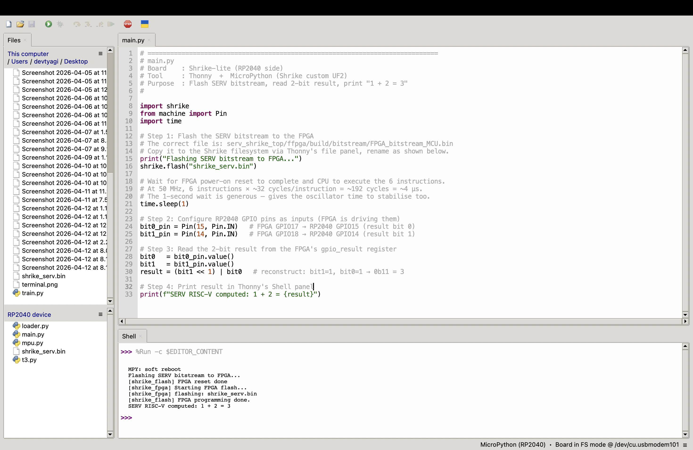

# shrike_serv

**Difficulty:** Advanced
**Uses MCU:** Yes
**External Hardware:** None

World's first documented port of a RISC-V soft CPU to the Renesas SLG47910
ForgeFPGA. Runs [SERV](https://github.com/olofk/serv) entirely on FPGA fabric.

---

## Expected Output

```
Flashing SERV bitstream to FPGA...
[shrike_flash] FPGA programming done.
SERV RISC-V computed: 1 + 2 = 3
```



---

## Compatibility

| Board | MCU | Status |
|---|---|---|
| Shrike-lite | RP2040 | Tested and working |
| Shrike | RP2350 | Untested |
| Shrike-fi | ESP32-S3 | Untested |

---

## Resource Utilisation

| Resource | Used | Available | % |
|---|---|---|---|
| CLB LUT5s | 516 | 1120 | 46 |
| FFs | 230 | 1120 | 21 |
| CLBs | 109 | 140 | 78 |
| GPIOs | 6 | 19 | 32 |

---

## Directory Structure

```
shrike_serv/
├── README.md
├── shrike_serv.ffpga          # Go Configure project file
├── ffpga/
│   └── src/
│       ├── serv_shrike_top.v  # Top-level wrapper
│       ├── nuclear_rom.v      # Hardcoded instruction ROM
│       └── serv_rf_ram_shrike.v  # FF register file
├── images/
│   └── output.JPG
├── firmware/
│   └── micropython/
│       └── shrike_serv.py
└── bitstream/
    └── shrike_serv.bin        # Pre-built bitstream
```

---

## Setup

### Step 1 — Get SERV RTL files

```bash
git clone https://github.com/olofk/serv
cp serv/rtl/*.v ffpga/src/
```

> Do **not** copy `serv_rf_ram.v` — use `serv_rf_ram_shrike.v` instead.

### Step 2 — Edit serv_rf_top.v

```verilog
// Find this line in serv_rf_top.v and change:
serv_rf_ram     #(.DEPTH(32), .RF_W(RF_W)) rf_ram (...);
// To:
serv_rf_ram_shrike #(.DEPTH(16), .RF_W(RF_W)) rf_ram (...);
```

### Step 3 — Open in Go Configure

Open `shrike_serv.ffpga` directly in Go Configure Software Hub.

If rebuilding from scratch, add files in this order:
```
ffpga/src/serv_state.v
ffpga/src/serv_decode.v
ffpga/src/serv_immdec.v
ffpga/src/serv_bufreg.v
ffpga/src/serv_bufreg2.v
ffpga/src/serv_alu.v
ffpga/src/serv_mem_if.v
ffpga/src/serv_csr.v
ffpga/src/serv_ctrl.v
ffpga/src/serv_rf_if.v
ffpga/src/serv_rf_ram_if.v
ffpga/src/serv_rf_ram_shrike.v
ffpga/src/serv_rf_top.v
ffpga/src/serv_top.v
ffpga/src/nuclear_rom.v
ffpga/src/serv_shrike_top.v
```

**IO Planner — assign ONLY:**

| Signal | Resource |
|---|---|
| `clk` | `OSC_CLK` |
| `clk_en` | `OSC_EN` |

Leave all `result_bit*` signals unassigned — see toolchain note 3 below.

Click **Synthesize** then **Generate Bitstream**.

### Step 4 — Flash and run

Copy `bitstream/shrike_serv.bin` to the board via Thonny file panel, then run
`firmware/micropython/shrike_serv.py`.

---

## How to Change the Computation

To compute something other than `1 + 2 = 3`, edit `ffpga/src/nuclear_rom.v`.

### Understanding the instruction encoding

Each line in the `case()` block is one 32-bit RISC-V instruction. The hex
values encode standard RV32I instructions. Use any RISC-V assembler or the
table below to get the hex for your instruction.

### Example — compute 4 + 5 = 9

Open `ffpga/src/nuclear_rom.v` and change the program:

```verilog
always @(*) begin
  case (i_adr[4:2])
    3'd0 : o_dat = 32'h00400093;   // addi x1, x0, 4   → x1 = 4
    3'd1 : o_dat = 32'h00500113;   // addi x2, x0, 5   → x2 = 5
    3'd2 : o_dat = 32'h002081B3;   // add  x3, x1, x2  → x3 = 9
    3'd3 : o_dat = 32'h40000237;   // lui  x4, 0x40000 → x4 = GPIO base
    3'd4 : o_dat = 32'h00322023;   // sw   x3, 0(x4)   → output result
    3'd5 : o_dat = 32'h0000006F;   // jal  x0, 0       → halt
    default : o_dat = 32'h00000013; // nop
  endcase
end
```

### Encoding your own `addi` instruction

The `addi x1, x0, N` instruction puts the value `N` into register `x1`.

```
Hex format:  0xNNN00093
             ^^^           = immediate value N in hex (12-bit, max 2047)
                ^^         = source register x0 = 00
                  ^        = destination register x1 = 1
                   ^^^     = opcode for addi
```

Quick reference:

| Value | addi x1 instruction | addi x2 instruction |
|---|---|---|
| 1 | `32'h00100093` | `32'h00100113` |
| 2 | `32'h00200093` | `32'h00200113` |
| 3 | `32'h00300093` | `32'h00300113` |
| 4 | `32'h00400093` | `32'h00400113` |
| 5 | `32'h00500093` | `32'h00500113` |
| 10 | `32'h00A00093` | `32'h00A00113` |
| 20 | `32'h01400093` | `32'h01400113` |

After editing, re-synthesise and re-generate the bitstream in Go Configure,
then copy the new `FPGA_bitstream_MCU.bin` to the board as `shrike_serv.bin`.

### Result output range

The current design outputs `dbus_dat[1:0]` — 2 bits — so the readable result
range is 0–3. For larger results, modify `serv_shrike_top.v` to output more
bits (add `result_bit2`, `result_bit3`, etc.) and update the IO Planner and
`firmware/micropython/shrike_serv.py` to read the extra pins.

---

## Toolchain Notes (Novel Findings for SLG47910)

### 1. BRAM initialisation crash

`$readmemh` → Yosys falls back to RAMSRL → ~820 LUTs consumed → compiler aborts.

**Fix:** `case()` combinational block in `nuclear_rom.v` — pure LUT logic,
no BRAM, no RAMSRL.

### 2. Silent register file routing failure

`serv_rf_ram.v` uses a `reg` array → Yosys infers RAMSRL → Forge PNR silently
fails to route → CPU frozen at `PC=0x00`, no error reported, bitstream appears
to generate successfully.

**Fix:** `(* ram_style = "registers" *)` in `serv_rf_ram_shrike.v` → plain DFFs.

### 3. IO Planner explicit GPIO17/18 assignment breaks output

Manually assigning `result_bit*` signals in IO Planner conflicts with Yosys
auto-routing. FPGA GPIO17/18 are the only pins hardwired to RP2040 GPIO14/15
via PCB 0-ohm resistors. Auto-routing correctly places signals there.

**Fix:** Assign ONLY `clk → OSC_CLK` and `clk_en → OSC_EN`. Leave result
signals unassigned.

---

## References

- [SERV](https://github.com/olofk/serv) by Olof Kindgren (ISC licence)
- [SLG47910 Datasheet](https://www.renesas.com/en/products/slg47910)
- [Shrike documentation](https://vicharak-in.github.io/shrike/)
- [Go Configure Software Hub](https://www.renesas.com/en/software-tool/go-configure-software-hub)

---

## Licence

GPL-2.0. SERV RTL files retain their original ISC licence headers.
